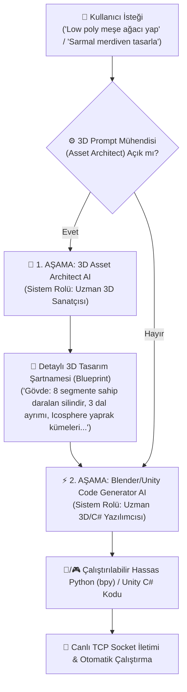

# 🧊 🎮 Yengi Blender & Unity 3D Copilot System Architecture

> **Doküman Amacı**: Blender 3D ve Unity Engine entegrasyonu için yapılan geliştirmeleri, mimari şemaları ve sürüm öncesi README'ye eklenecek maddeleri kayıt altına alan resmi sistem dokümanıdır.

---

## 🎨 1. Çift Aşamalı (Two-Stage) 3D Asset Architect Mimarisi

Yengi'nin 3D modelleme ve oyun motoru komutlarında ilkel/baştan savma geometriler yerine yüksek kaliteli, oranlı ve estetik 3D modeller üretebilmesi için kurulan 2 aşamalı otonom yapay zekâ zinciridir:



### 💡 Neden Çift Aşamalı Yapı?
- **1. Aşama (Sanatçı Rolü)**: Kullanıcının basit isteğini alıp geometrik parçalara, metre cinsinden oranlara, mat/metalik renk paletlerine ve parça temas kurallarına dönüştürür.
- **2. Aşama (Yazılımcı Rolü)**: Tasarım kararlarıyla vakit kaybetmeden doğrudan gelen ayrıntılı şartnameyi %100 kusursuz koda dönüştürür.
- **Kullanıcı Kontrolü**: İstenildiği an `Ayarlar -> 3D Prompt Mühendisini (Asset Architect) Kullan` seçeneği kapatılarak devre dışı bırakılabilir.

---

## 🧊 2. Tamamlanan Blender Copilot v1.5 Özellikleri

1. **Blender N-Panel UI (3D Viewport Sidebar)**:
   - Blender `N` menüsünde **"🚀 Yengi Copilot"** sekmesi.
   - Canlı bağlantı durumu göstergesi (🟢 Sunucu Dinliyor - Port 8181).
   - "📸 Viewport Resmi Al" ve "📊 Sahne Özetini Yazdır" hızlı işlem butonları.
   - Son komut durumu ve log görünümü.
2. **JSON-RPC Protokolü**:
   - Yapılı mesajlaşma: `execute`, `get_scene_info`, `capture_viewport`, `undo`.
3. **Canlı Sahne RAG (Context Injection)**:
   - Sahnede önceden oluşturulmuş nesneleri, materyalleri, kamerayı ve çalışma modunu Yengi'ye ileterek çakışmasız, hafızalı kod üretimi.
4. **Viewport Ekran Görüntüsü Alma (`render.opengl`)**:
   - Her komut sonrasında 3D ekranın anlık görüntüsü çekilip Yengi'ye aktarılır.
5. **Güvenli Undo & Transaction Checkpoint**:
   - Script çalıştırılmadan önce `bpy.ops.ed.undo_push()` yapılarak olası hatalarda sahne eski haline döner.
6. **Self-Healing (Kendi Kendini Düzelten Döngü)**:
   - Blender'da oluşan hataların Python `traceback` dökümü alınarak Yengi tarafından otomatik olarak 2 defaya kadar düzeltilip yeniden çalıştırılması.

---

## 🎮 3. Unity Engine Copilot İçin Yapılacaklar (Plan)

Blender'da başarıyla tamamlanan bu sistemi Unity tarafına aktaracağız:

1. **Unity Socket Sunucusu Güncellemesi (`YengiUnityCopilot.cs` - Port 8282)**:
   - JSON-RPC haberleşme altyapısına geçiş.
   - `get_scene_info`: Sahnemdeki `GameObject` hiyerarşisi, Component'ler (Rigidbody, Collider, MeshRenderer), materyaller ve aktif seçim.
2. **Unity 2-Stage Asset & C# Script Architect**:
   - Unity için 3D Prompt Mühendisi katmanı (Örn: "Düşman zombi oluştur" -> Rigidbody, NavMeshAgent, Animator, HealthScript bileşenleriyle zenginleştirme).
3. **Unity GameView / SceneView Screenshot Capture**:
   - Unity Editör ekranının anlık görüntüsünü alıp Yengi Chat paneline aktarma.
4. **Unity Self-Healing C# Compilation Repair**:
   - Unity derleme hatalarında (C# Compiler errors) Yengi'nin hataları yakalayıp C# Editor scriptini otomatik düzeltmesi.

---

## 📝 4. Proje Bittiğinde README.md'ye Eklenecek Sürüm Notları

### 🇺🇸 English (README.md)
```markdown
### 🧊 3D Blender & 🎮 Unity Live Engine Copilots
- **Two-Stage 3D Asset Architect Pipeline**: Converts simple user prompts into rich procedural 3D specs before generating code.
- **Live 3D Scene RAG**: Queries active viewport objects, materials, hierarchy, and cameras to prevent duplication.
- **Blender Viewport N-Panel & OpenGL Snapshots**: Real-time status panel inside Blender 3D Viewport with live preview captures.
- **Self-Healing Code Execution**: Automatically parses Python `traceback` / C# compile errors and repairs scripts on the fly with atomic undo checkpoints.
```

### 🇹🇷 Türkçe (README.tr.md)
```markdown
### 🧊 3D Blender & 🎮 Unity Canlı Motor Kopilotları
- **Çift Aşamalı 3D Asset Architect Mimarisi**: Basit 3D isteklerini koda dönüştürmeden önce prosedürel detaylar, oranlar ve materyallerle zenginleştirir.
- **Canlı 3D Sahne RAG (Konteks Altyapısı)**: Sahnede önceden var olan objeleri, materyalleri ve kameraları okuyarak akıllı kod üretimi sağlar.
- **Blender N-Panel UI & Canlı Viewport Ekran Görüntüsü**: Blender 3D Viewport içinde canlı durum paneli ve üretilen sahnenin anlık görsel dökümü.
- **Kendi Kendini Düzelten (Self-Healing) Döngü**: Oluşan Python dökümlerini ve C# derleme hatalarını otomatik yakalayıp kendi kendini düzelten otonom yapı.
```
