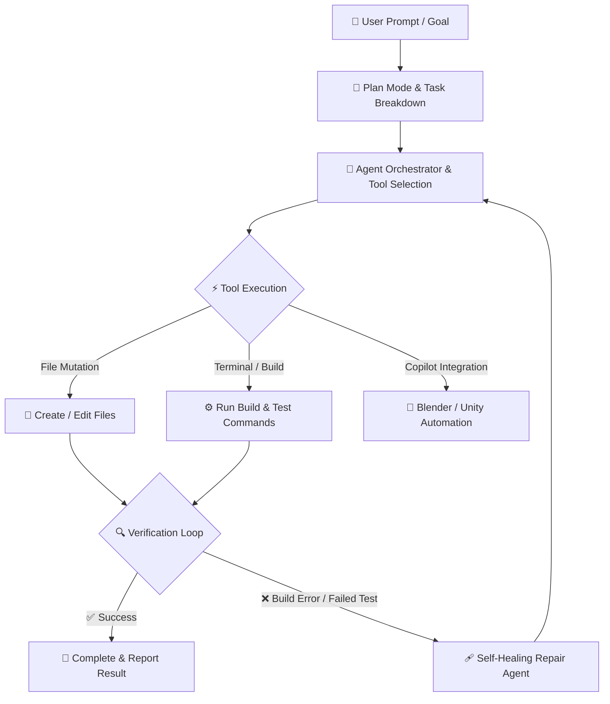
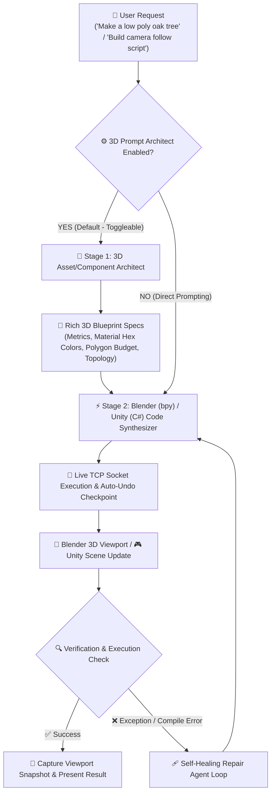
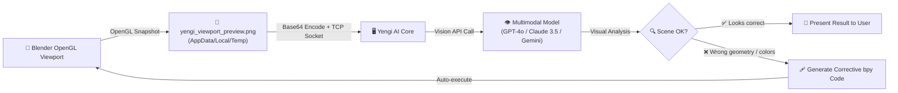

Read this in: [🇹🇷 Türkçe](README.tr.md) | 🇺🇸 English

---

<p align="center">
  
</p>

# 🚀 Yengi AI IDE

> **Y**our **E**ngineering **N**exus, **G**enerative **I**ntelligence.  
> *"Yengi: The rewarding milestone reached after long, dedicated effort."*

[](https://github.com/mdaiWorks/yengi/actions/workflows/build-and-test.yml)
[](https://github.com/mdaiWorks/yengi/releases)
[](https://dotnet.microsoft.com/)
[](https://microsoft.com/windows)
[](LICENSE)
[](https://huggingface.co/)

**Yengi is a free, open-source Windows desktop AI IDE powered by .NET 10 (LTS). It combines local LLMs (Ollama, Qwen, DeepSeek) and cloud APIs with autonomous tool execution, self-healing build verification, and live 3D/game engine copilots.**

---

## 🎬 Visual Showcase

| 🌐 Web App & Image Studio | 🧊 Live 3D Blender Copilot |
| :---: | :---: |
|  |  |

| 🎮 Unity Game Engine Copilot | 🖥️ Modern IDE Workspace |
| :---: | :---: |
|  |  |

▶️ **[Watch the YouTube Video Walkthrough & Live Tetris Demo](https://youtu.be/l0tdhvCmwNI)**

---

## 🧠 Autonomous Agent Loop Architecture

Yengi goes beyond a standard AI chat box. It runs an end-to-end **Plan → Tool Call → Code Mutation → Verification → Auto-Fix** cycle directly on your workspace.



---

## 🎨 Two-Stage 3D Asset & Component Architect Pipeline

Yengi features a specialized **2-Stage Autonomous AI Pipeline** for Blender 3D and Unity Engine copilots. Instead of producing naive primitive shapes, Yengi separates artistic design reasoning from code synthesis:



- **Stage 1 (3D Artist / Architect)**: Deconstructs raw user requests into anatomical specifications, metric dimensions, flat shading rules, and Principled BSDF color palettes.
- **Stage 2 (Code Generator)**: Reads the generated blueprint and scene context RAG data to synthesize 100% bug-free `bpy` Python or Unity Editor C# code.
- **Toggleable Option**: Can be easily enabled/disabled in **Workspace Settings** (`⚙️`) for full developer control.

---

## 👁️ Live Viewport Vision — AI Eyes on Your 3D Scene

When using a **multimodal-capable model** (GPT-4o, Claude 3.5 Sonnet, Gemini 1.5/2.0), Yengi can literally **see** your Blender 3D viewport in real-time and make visually-informed corrections:



1. **Capture** — Blender captures an OpenGL viewport snapshot → saved to `yengi_viewport_preview.png`
2. **Transmit** — Image is Base64-encoded and sent to Yengi via live TCP socket (port 8181)
3. **Inspect** — The multimodal AI model examines the rendered 3D scene visually
4. **Correct** — If geometry, materials, or proportions are off, the AI auto-generates and executes corrective `bpy` code

> [!TIP]
> Use the **"Viewport Resmi Al"** button in Blender's N-Panel (press `N` in viewport) to trigger a snapshot at any time, or let the Two-Stage Pipeline capture it automatically after each operation.

---

## 💡 Why Yengi?

Yengi was created around a simple idea: **your AI development environment shouldn't depend on a single provider, model, or usage quota.**

Use local open-weights models through Ollama, connect your own API keys (Claude, OpenAI, Gemini), or leverage Yengi's custom fine-tuned local router. Build with autonomous agent workflows while maintaining total control over your models, tools, and privacy.

---

## ✨ Key Features

- 🧠 **Custom 1.5B Local AI Router**: Fine-tuned 1.5B routing model designed to select the appropriate AI workflow and tool context autonomously.
- 🎛️ **4 Specialized Development Modes**: **Code IDE**, **Image Generation Studio**, **Blender 3D Copilot**, and **Unity Engine Copilot**.
- 🔒 **Local-First & Model Agnostic**: Connects seamlessly to **Ollama (Qwen 35B, DeepSeek-R1)**, Claude 3.5, OpenAI, or Gemini. Keeps your project data on your machine when choosing local providers.
- 🛡️ **Self-Healing Verification Loop**: Automatically runs build/syntax checks (`dotnet build`, `npm test`, Python linters) and repairs errors autonomously.
- 🔄 **1-Click Auto-Updates**: Integrated GitHub Releases API updater detects and installs new setup releases automatically.
- 🧊 **Blender & Unity Copilots**: Live two-way JSON-RPC integration with Scene RAG, Two-Stage Architect Pipeline, self-healing loop, and auto-undo checkpoints.
- 👁️ **Live Viewport Vision**: Multimodal AI models (GPT-4o, Claude 3.5, Gemini) can **see** your Blender scene via OpenGL snapshots and autonomously correct geometry, materials, or proportions in a closed feedback loop.
- ⚡ **Built with .NET 10 (LTS)**: High-performance WPF architecture backed by **200+ passing unit tests**.
- 🧰 **30+ Native Agent Tools**: File system search, Git operations, terminal execution, RAG context indexing, and web browser previews.

---

## 📖 Detailed Documentation & Full Tool Reference

For a complete breakdown of all **30+ AI Agent Tools**, internal Verification Loop mechanisms, RAG architecture, and UI button references, see the **[Full Technical Documentation (DOCS_FULL.md)](DOCS_FULL.md)** | **[Detaylı Türkçe Dokümantasyon (DOCS_FULL.tr.md)](DOCS_FULL.tr.md)**.

---

## 🚀 Quick Start

### Option A: Install Executable (Recommended)
1. Download the latest `Yengi_Setup.exe` installer from [GitHub Releases](https://github.com/mdaiWorks/yengi/releases/latest).
2. Run the installer and launch Yengi.
3. Configure your preferred model in **Settings** (Ollama, Anthropic, OpenAI, or Gemini) and start building!

### Option B: Run from Source (.NET 10 SDK)
```bash
# Clone the repository
git clone https://github.com/mdaiWorks/yengi.git
cd yengi

# Build and run with .NET 10
dotnet run --project BasucuIDE/mdaiAgent.csproj
```

---

## 👤 Creator's Note & Philosophy

> *"I am a teacher, not a corporate C# developer."*

Yengi was built by acting as an **Architect and AI Orchestrator**. Using AI tools (Google Antigravity & GitHub Copilot) for code generation while designing the architecture, verification loops, security boundaries, and local router model myself.

Yengi is **100% Free, Open Source, and Telemetry-Free**. If Yengi inspires your workflow, consider giving it a ⭐ **Star on GitHub**!

---

## 📄 License

Distributed under the [AGPL-3.0 License](LICENSE).
