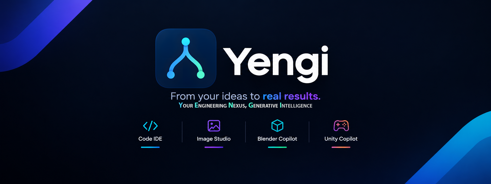
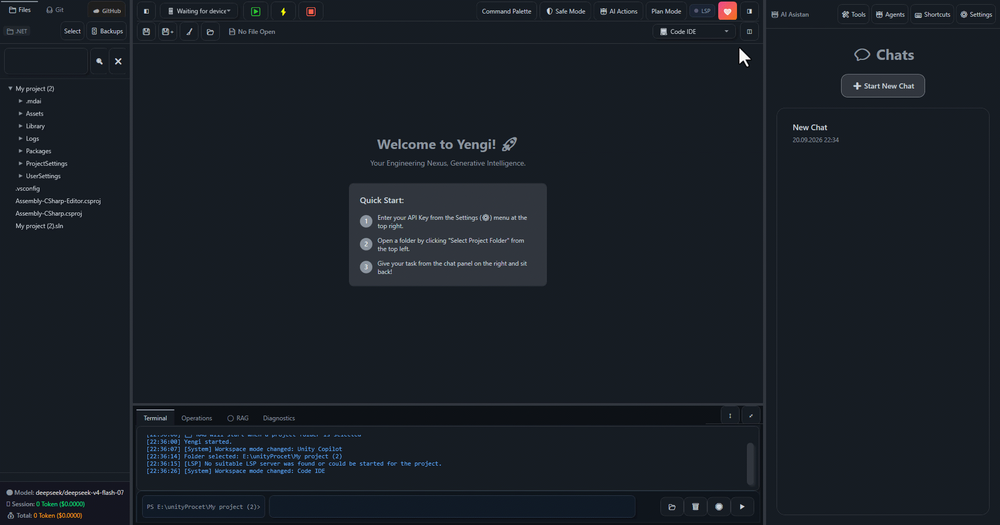
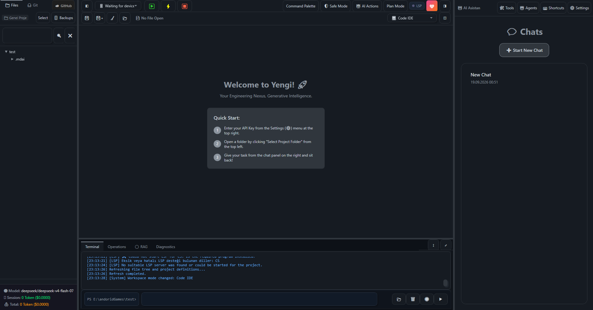
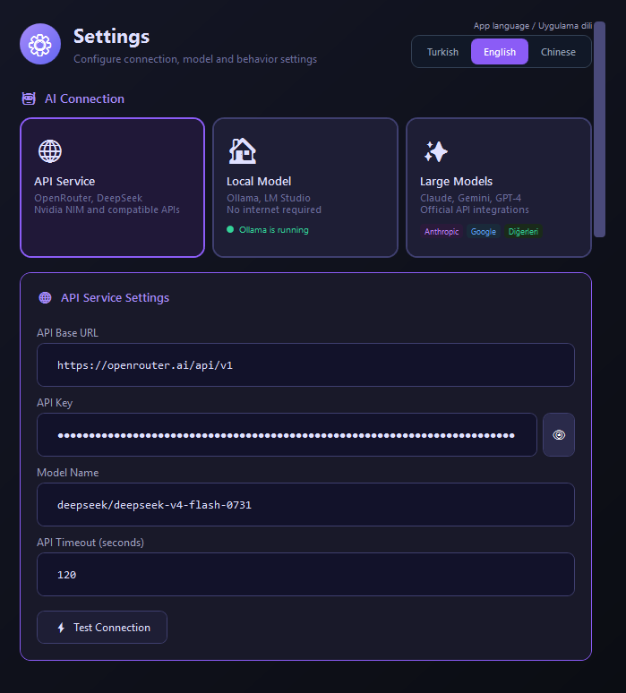

Dili Değiştir: 🇹🇷 Türkçe | [🇺🇸 Read in English](README.md)

---

<p align="center">
  
</p>

# 🚀 Yengi

> **Y**our **E**ngineering **N**exus, **G**enerative **I**ntelligence — *Mühendisliğinin Merkezi, Üretken Zekâ.*  
> *"Yengi; Uzun süre uğraştığın bir şeyin sonunda başarıyla sonuçlanması, emeğinin karşılığında ulaştığın o mutlu sonucun adı."*

[](LICENSE)
[](https://dotnet.microsoft.com/)
[](https://microsoft.com/windows)
[](https://huggingface.co/)
[](https://buymeacoffee.com/mdaiyazilim)

**Yerel ve bulut AI modelleriyle çalışan, proje dosyalarını okuyup değiştirebilen, terminal/derleme/test işlemleri yapabilen ve agent tabanlı iş akışları sunan Windows masaüstü AI yazılım geliştirme asistanı.**

Yengi, klasik bir "AI sohbet penceresi" olmaktan ziyade, kullanıcının seçtiği bir yazılım projesi üzerinde **kod anlama → planlama → araç seçimi → dosya değişikliği → terminal/derleme/test → doğrulama → sonuç** döngüsünü uçtan uca yürütmek üzere tasarlanmış bir WPF/.NET 8 masaüstü uygulamasıdır.

Bu README, projenin kaynak kodunun (100+ dosya) doğrudan taranması ve içindeki somut sayısal/teknik iddiaların (limitler, dosya yolları, varsayılan değerler) tek tek koddan doğrulanmasıyla hazırlanmıştır.

---

## 🎬 Video Gösterimi ve İnceleme

[](https://youtu.be/l0tdhvCmwNI)
> 👆 *Yerel Yengi Router kurulumu, canlı Web Tetris oyunu yapımı ve canlı oyun deneyimini izlemek için yukarıdaki görsele tıklayın!*

---

## ✨ Canlı Özellik Gösterimleri

### 🌐 Web Uygulaması Geliştirme & AI Görsel Üretimi


### 🧊 Blender 3D Copilot Canlı 3D Modelleme


### 🎮 Unity Oyun Motoru Copilot Canlı Entegrasyonu


---

## 📸 Arayüz & Ekran Görüntüleri

| Ana IDE & Sohbet Alanı | Ayarlar & Yerel Router Kurulumu |
| :---: | :---: |
|  |  |

---

## İçindekiler

- [1. Genel Bakış](#1-genel-bakış)
- [2. Temel Özellikler](#2-temel-özellikler)
- [3. Mimari](#3-mimari)
- [4. AI Agent Akışı](#4-ai-agent-akışı)
- [5. Tool Sistemi (31 Araç)](#5-tool-sistemi-31-araç)
- [6. Arayüz ve Buton Referansı](#6-arayüz-ve-buton-referansı)
- [7. Chat ve Oturum Sistemi](#7-chat-ve-oturum-sistemi)
- [8. Plan Mode](#8-plan-mode)
- [9. Verification Loop (Self-Healing)](#9-verification-loop-self-healing)
- [10. Sub-Agent / Delegation](#10-sub-agent--delegation)
- [11. AI Router](#11-ai-router)
- [12. RAG](#12-rag)
- [13. Kod Editörü](#13-kod-editörü)
- [14. Terminal, Build ve Proje Türü Tespiti](#14-terminal-build-ve-proje-türü-tespiti)
- [15. Git Entegrasyonu](#15-git-entegrasyonu)
- [16. Plugin ve LSP Sistemi](#16-plugin-ve-lsp-sistemi)
- [17. Sesli Komut](#17-sesli-komut)
- [18. Provider Mimarisi](#18-provider-mimarisi)
- [19. Güvenlik](#19-güvenlik)
- [20. Checkpoint / Backup](#20-checkpoint--backup)
- [21. Context ve Token Yönetimi](#21-context-ve-token-yönetimi)
- [22. Proje Anayasası ve Hafıza](#22-proje-anayasası-ve-hafıza)
- [23. Çoklu Dil Desteği (i18n)](#23-çoklu-dil-desteği-i18n)
- [24. Proje Dosya Yapısı](#24-proje-dosya-yapısı)
- [25. Kurulum ve Yapılandırma](#25-kurulum-ve-yapılandırma)
- [26. Teknik Bağımlılıklar](#26-teknik-bağımlılıklar)
- [27. Mevcut Durum ve Bilinen Sınırlar](#27-mevcut-durum-ve-bilinen-sınırlar)
- [28. Tamamlanan Geliştirme Fazları](#28-tamamlanan-geliştirme-fazları)
- [29. Kalan Geliştirme Alanları](#29-kalan-geliştirme-alanları)

---

# 1. Genel Bakış

Yengi'nin temel amacı, geliştiricinin proje üzerinde tekrar tekrar yaptığı işleri AI ile birleştirmektir. Kullanıcı örneğin:

> "Login ekranındaki hatayı bul, düzelt, projeyi derle ve testleri çalıştır."

dediğinde, sistem yalnızca kod üretmekle kalmaz; gerekli bağlamı keşfeder, uygun araçları seçer, dosyaları değiştirir ve değişikliği **kendi kendine doğrular.**

```text
Kullanıcı
   │
   ▼
Chat UI
   │
   ▼
ChatFlowService  (gerçek zamanlı çalışan tek orkestratör — bkz. Bölüm 3.2)
   │
   ├── Context / History
   ├── RAG
   ├── Router
   ├── Planning
   └── Tool Definitions
   │
   ▼
AI Provider (Anthropic / Google / OpenAI / ApiService / LocalModel)
   │
   ▼
Tool Calls → ToolExecutor
   │
   ├── File Operations   ├── Terminal / Build / Test
   ├── Search             ├── Git
   ├── Planning           ├── Checkpoint
   ├── Web                ├── Screenshot
   └── Sub-Agent          └── User Interaction (AskUserOptions)
   │
   ▼
Verification / Recovery (self-healing)
   │
   ▼
Chat UI + Timeline + Todo List + File Changes paneli
```

---

# 2. Temel Özellikler

- AI destekli kod sohbeti, proje klasörü seçimi, tam özellikli kod editörü (AvalonEdit)
- **5 provider kategorisi:** Anthropic (Claude), Google (Gemini), doğrudan OpenAI, OpenAI-uyumlu bulut servisleri (OpenRouter/DeepSeek/Nvidia NIM), yerel modeller (Ollama/LM Studio)
- AI Router (küçük modelle akıllı araç seçimi) + manuel araç yönetimi (tool pruning)
- Kanıta dayalı görev tamamlama: build/test doğrulaması olmadan proje görevi tamamlanmış sayılmaz
- Yüksek riskli terminal/build/test araçları için capability ve kullanıcı onay kapısı
- Plan Mode, Task Graph, Retry/Recovery Plan
- Verification Loop (derleme sonrası kendi kendini doğrulama ve onarma)
- Checkpoint oluşturma / rollback, otomatik yedekleme (Backup Viewer)
- Dosya okuma/oluşturma/kısmi güncelleme, diff önizleme
- Terminal, build, test çalıştırma; proje türüne göre akıllı komut doğrulama
- Git entegrasyonu (stage/commit/push, LibGit2Sharp)
- Proje context keşfi, kod arama, dosya arama
- **RAG** (embedding tabanlı anlamsal kod arama) + proje izleyici (otomatik yeniden indeksleme)
- Chat oturum yönetimi, geçmiş, Timeline, Todo listesi, dosya değişiklikleri paneli
- Sub-agent / task delegation (arka planda bağımsız görev başlatma)
- Web arama (Tavily), web sayfası okuma, ekran görüntüsü alma (UI hatası analizi için)
- Sesli komut / speech-to-text (STT, ana modelden bağımsız)
- LSP (Language Server Protocol) altyapısı + 14 dil için yerleşik statik hata denetleyici plugin + harici DLL plugin desteği
- Ayarlar, TR/EN/ZH localization, klavye kısayolları, Command Palette
- Safe Automation (güvenli mod), terminal komut onay penceresi, path/symlink güvenlik kontrolü
- Toast bildirimleri, token kullanım takibi, provider fallback altyapısı

---

# 3. Mimari

## 3.1 Ana katmanlar

```text
┌──────────────────────────────────────────────┐
│                   WPF UI                      │
│  MainWindow + Dialoglar + Ayarlar + Paneller  │
└──────────────────────┬───────────────────────┘
                        │
┌──────────────────────▼───────────────────────┐
│         Chat / Orchestration                  │
│  ChatFlowService, AiActionService,            │
│  ChatSessionService                           │
└──────────────────────┬───────────────────────┘
                        │
           ┌────────────┼────────────┐
           ▼            ▼            ▼
        Router       Planning       RAG
           │            │            │
           └────────────┼────────────┘
                         ▼
┌──────────────────────────────────────────────┐
│                AI Providers                   │
│  Anthropic / Google / OpenAI / ApiService /   │
│  LocalModel  (IAiProvider ortak arayüzü)      │
└──────────────────────┬───────────────────────┘
                        │
                        ▼
┌──────────────────────────────────────────────┐
│                 ToolExecutor                  │
│  Path/symlink güvenliği + onay akışı + dispatch│
└──────────────────────┬───────────────────────┘
                        │
          ┌─────────────┼─────────────────┐
          ▼             ▼                 ▼
       Services       Git / LSP         Plugins
          │
          ▼
 Dosyalar / Terminal / Build / Test / Web / RAG / ...
```

## 3.2 Orkestrasyon: `ChatFlowService` vs `AgentCoreRuntime`

**`ChatFlowService`** — sohbet akışının **fiilen çalışan tek merkezi**dir. `MainWindow` başlatılırken örneklenen tek orkestratör budur (`_chatFlowService = new ChatFlowService(...)`). Sorumlulukları:

- Oturum yönetimi, mesaj gönderme, AI pipeline'ı
- Tool çağrılarının yürütülmesi ve sonuçlarının işlenmesi
- History yönetimi (bkz. Bölüm 21), RAG bağlantısı, verification servisi tetikleme
- Değişen dosyaların belirlenmesi, AI yanıtının UI'a aktarılması, retry/recovery, agent workflow event'leri (Timeline/Todo)

**`IAgentCore` / `AgentCoreRuntime`** — UI'dan bağımsız agent yürütme ve doğrulama sınırıdır (tool execution, verification, checkpoint, rollback ve event subscription arayüzleri içerir). Güvenli runtime oluşturma, production-readiness kontrolü, tool capability doğrulaması ve verification runner enjeksiyonu hazırdır. `ChatFlowService` ana sohbet orkestratörü olarak kalır; ana tool dispatch, Verification 2.0, checkpoint/rollback ve Timeline EventBus akışları production-safe runtime üzerinden çalışır.

---

# 4. AI Agent Akışı

```text
1. Kullanıcı mesajı
2. Aktif proje + chat history hazırlanır
3. Gerekirse RAG / project discovery çalışır
4. Router / model seçimi yapılır (aktifse)
5. AI modeline tool tanımlarıyla istek gönderilir
6. AI tool çağrısı üretir
7. ToolExecutor çağrıyı karşılar → güvenlik/path/onay kontrolü
8. Tool çalıştırılır, sonuç AI'a geri gönderilir
9. Gerekirse yeni tool çağrıları (döngü)
10. Dosya değişiklikleri sonrası sessizce BuildProject (self-healing)
11. Hata varsa: kendi kendine düzelt (maks. 3 deneme) → hâlâ hata varsa WebSearch/WebFetch ile araştır → tekrar dene
12. Final yanıt + kısa özet (ne yapıldı / dikkat noktası / sıradaki adım)
```

Bu akış, `ToolDefinitions.cs` içindeki sistem promptunda (`GetCoreSystemPrompt`) ayrıntılı kurallarla modele dikte edilir: dosya düzenlemeden önce mutlaka okuma, iç araç adlarının kullanıcıya asla söylenmemesi, mimari belirsizlikte kullanıcı onayı alınmadan koda geçilmemesi, TODO panelinin event'lerle (`ReadingFile/EditingFile/.../Completed/Failed`) otomatik güncellenmesi gibi.

---

# 5. Tool Sistemi (31 Araç)

Tanımlar `ToolDefinitions.cs`'de, yürütme `ToolExecutor.cs` + `Services/*`'de.

| Kategori | Araçlar |
|---|---|
| **Dosya** | `ReadFile` (opsiyonel startLine/endLine), `CreateOrUpdateFile`, `ReplaceFileContent` (kısmi/hedefli değişiklik) |
| **Terminal** | `ExecuteTerminalCommand` (opsiyonel `workingDirectory`, belirtilmezse proje kökü), `ReadToolOutput` (kısaltılmış uzun çıktının geçici tam halini satır aralığıyla okur) |
| **Görsel analiz** | `TakeScreenshot` (dosya veya base64 çıktı, UI hatası analizi için) |
| **Proje keşfi** | `FindFiles`, `SearchCode`, `ListDirectory`, `DiscoverProjectContext` |
| **Build/Test** | `BuildProject` (.csproj/.sln), `RunTests` |
| **Planlama / Hafıza** | `CreatePlan`, `CreateTaskGraph`, `RetryPlan` (recovery), `GenerateDiff`, `ReadProjectMemory`, `WriteProjectMemory`, `SearchProjectMemory`, `ArchiveProjectMemory`, `WriteDecision`, `WriteTask` (`.mdai/memory.json`, `.mdai/decisions.json`, `.mdai/tasks/`) |
| **Checkpoint** | `CreateCheckpoint`, `RollbackToCheckpoint` |
| **Hızlı komutlar** | `CreateQuickCommand`, `ExecuteQuickCommand` (`CommandService` üzerinden) |
| **Web** | `WebSearch` (Tavily API), `WebFetch` |
| **Delegasyon** | `DelegateTask` (`role`, `prompt`, `context` parametreleri; `DelegationService` + `SubAgentResultCoordinator` ile çalışır; `waitForCompletion=true` ile ana akış sonucu bekleyebilir, timeout mekanizması vardır) |
| **Kullanıcı etkileşimi** | `AskUserOptions` (popup'ta seçimli/serbest metin soru; `allowMultiple` ile çoklu seçim), `SmartRecovery` (hata sonrası kurtarma planı) |

> `DelegateTask`'taki `role` serbest bir metin alanıdır (sabit bir rol listesi/enum değildir); "Backend Developer", "Researcher", "Tester" gibi isimler modelin kendi seçtiği örnek rollerdir.

### 5.1 Yakın görevli araçların farkı

| Araçlar | Farkı |
|---|---|
| `CreatePlan` / `CreateTaskGraph` | `CreatePlan` uygulanacak adımları ve incelenecek dosyaları planlar. `CreateTaskGraph` bu işi bağımlılıkları olan görev düğümleri şeklinde modeller. |
| `CreatePlan` / `WriteTask` | `CreatePlan` ne yapılacağını üretir. `WriteTask` görevin mevcut durumunu (`in-progress`, `completed`, `blocked`) ve ilerleme notlarını kalıcı kaydeder. |
| `WriteDecision` / `WriteProjectMemory` | `WriteDecision` belirli bir mimari kararın ne olduğunu ve neden alındığını kronolojik günlüğe ekler. `WriteProjectMemory` tekrar kullanılacak kalıcı architecture/conventions bilgisini anahtar-değer olarak saklar veya günceller. |
| `ReadProjectMemory` / `SearchProjectMemory` | `ReadProjectMemory` tüm sürümlü hafızayı veya belirli bir anahtarı okur. `SearchProjectMemory` architecture/conventions kayıtlarında metin arar. |
| `ArchiveProjectMemory` | Hafıza kaydını silmez; artık geçerli olmayan architecture/conventions kaydını `archived` alanına taşır. |
| `ReplaceFileContent` / `GenerateDiff` | `ReplaceFileContent` dosyayı gerçekten değiştirir. `GenerateDiff` eski ve yeni içerik arasındaki önizlemeyi üretir. |
| `FindFiles` / `ListDirectory` | `FindFiles` isim/pattern ile arama yapar. `ListDirectory` belirli bir klasörün doğrudan içeriğini listeler. |
| `RetryPlan` / `SmartRecovery` | `RetryPlan` teknik hata için yeni recovery planı üretir. `SmartRecovery` kullanıcıya kurtarma seçenekleri sunan etkileşimli akıştır. |
| `CreateQuickCommand` / `ExecuteQuickCommand` / `ExecuteTerminalCommand` | İlki komut şablonu kaydeder, ikincisi kayıtlı şablonu çalıştırır, üçüncüsü doğrudan terminal komutu yürütür. |

---

# 6. Arayüz ve Buton Referansı

### Proje / dosya paneli
| Buton (`x:Name`) | İşlev |
|---|---|
| `btnSelectFolder` | Proje klasörü seçer |
| `btnShowBackups` | Otomatik yedekleri görüntüler (Backup Viewer) |
| `btnGitHubSync` | Projeyi GitHub'a push eder |
| `btnGitRefresh`, `btnStageAll`, `btnCommit` | Git durumunu yenile / tümünü stage et / commit et |
| `btnSearchFiles`, `btnClearSearch` | Dosya adında arama / temizleme |
| Dosya ağacı sağ tık menüsü | Refresh, New File, New Folder, Delete, Show in Explorer |
| Git listesi sağ tık menüsü | Stage / Unstage |

### Editör çubuğu
| Buton | İşlev |
|---|---|
| `btnSaveFile` / `btnSaveAll` | Kaydet (Ctrl+S) / Tümünü kaydet (Ctrl+Shift+S) |
| `btnFormatDocument` | Dosyayı otomatik biçimlendirir |
| `btnQuickOpenFile` | Hızlı dosya aç |
| `btnRunApp` / `btnHotReload` / `btnStopApp` | Çalıştır / Hot Reload / Durdur (`MainWindow.RunDebug.cs`) |
| `btnCommandPalette` | Komut paletini açar (Ctrl+P) |
| `btnSafeAutomation` ("Güvenli Mod") | Tüm otomasyon işlemleri için onay ister |
| `btnAiActions` + context menu | AI Refactor, Yorumları Geliştir, Dosyayı Açıkla, Plan Modu, Test Üret, Son AI Yanıtını Uygula |
| `btnPlanMode` | Adım adım uygulama planı hazırlar |
| `btnPluginManager` | Eklenti yöneticisini açar |
| `btnAbout` | Hakkında penceresi |

### Terminal paneli
| Buton | İşlev |
|---|---|
| `btnOpenTerminalPath` | Terminal çalışma dizinini açar |
| `btnClearTerminal` | Terminali temizler |
| `btnKillProcess` | Süreci sonlandırır |
| `btnRunCommand` | Komutu çalıştırır |

`TerminalService`, stdout/stderr, status ve busy-state event'leri üzerinden UI ile iletişim kurar.

Uzun build/test/terminal çıktıları `ContextOptimizerService` ile modele gönderilmeden önce kısaltılır. Tam çıktı geçici olarak `%TEMP%\mdaiAgent\tool-output` altında tutulur ve sonuçta `FULL_OUTPUT_ID` verilir. Model, gerekirse `ReadToolOutput` aracını kullanarak çıktının belirli satır aralığını okuyabilir. Geçici spool kayıtları 24 saat ve 50 dosya sınırıyla temizlenir; kısa çıktılar için spool dosyası oluşturulmaz.

### Tanılama paneli

Alt paneldeki `Tanılama` sekmesi aktif projenin verification ve tool telemetrilerini gösterir. Verification toplamı, başarı/başarısızlık sayısı, ortalama süre, son durum ve tool bazında çağrı/başarı/süre bilgileri görülebilir. `Yenile` paneli yeniden okur; `Telemetrileri Temizle` yalnızca tool ve verification kayıtlarını siler, token/maliyet toplamlarını korur.

### RAG paneli
| Buton | İşlev |
|---|---|
| `btnRagSettings` | RAG ayarlarını açar (API key/URL/model, aç-kapa) |
| `btnRagReindex` | Projeyi yeniden indeksler |

### Üst menü
| Buton | İşlev |
|---|---|
| `btnTools` | Modelin kullanabileceği araçları yönetir (otomatik/manuel) |
| `btnAgents` | Uzmanlaşmış alt-ajan modüllerini yönetir |
| `btnKeyboardShortcuts` | Klavye kısayolları |
| `btnSettings` | API anahtarları, Router, tema ayarları |

`AboutWindow` içindeki `Güncellemeleri denetle` butonu, yapılandırılmış GitHub Releases kanalını açmak için hazırdır. Güncelleme kanalı henüz ayarlanmamışsa kullanıcıya açıkça bildirilir; uygulama sahte bir güncelleme varmış gibi davranmaz.

### Sohbet paneli
| Buton / Kontrol | İşlev |
|---|---|
| `btnNewChatMain` | Yeni sohbet |
| `ChatSessionRename_Click` / `ChatSessionDelete_Click` | Sohbeti yeniden adlandır / sil |
| `btnShowChatHistory` / `btnShowTimeline` / `btnShowTodoList` / `btnShowFileChanges` | Sohbet geçmişi / iş akışı zaman çizelgesi / TODO listesi / değişen dosyalar panelleri |
| `btnClearHistory` | Geçmişi temizler (proje ayarları korunur) |
| `@mention` Chip etiketleri | Mesaj girdi alanında eklenen dosyaları silinebilir chip (`[ Foo.cs ✕ ]`) olarak yönetir |
| `cmbContextMode` | Bağlam modunu hızlıca değiştirir (Auto, Dosya, Seçim, Proje, RAG) |
| `cmbComposerModel` | Ana AI modelini veya Router modunu doğrudan Composer üzerinden seçer |
| `btnAttach` / `btnAttach2` | Dosya / öğe ekler |
| `btnVoice` | Push-to-talk sesli komut |
| `btnSend` / `btnStop` | Mesaj gönder / AI'ı durdur |
| Kod Bloğu `Uygula ↓` | AI kod yanıtlarını doğrudan aktif dosyaya diff önizlemesiyle uygular |
| `🧠 Working` Aktivite Kartı | AI mesaj balonu içinde canlı tool adımlarını katlanabilir özet olarak sunar |

### Command Palette (örnek komutlar)
| Komut | İşlev |
|---|---|
| Dosyayı Kaydet / Tümünü Kaydet | Aktif/tüm dosyaları kaydet |
| Yedekleri Görüntüle | Backup ekranı |
| AI Refaktör Et / Yorumları Geliştir / Dosyayı Açıkla / Test Üret / Plan Modu | AI Actions kısayolları |
| Son AI Yanıtını Uygula | Son yanıtı dosyaya uygular |
| Dokümanı Biçimlendir / Hızlı Dosya Aç | Editör kısayolları |

Ayrı pencereler: `SettingsWindow`, `PluginManagerWindow`, `RagSettingsWindow`, `RouterBlacklistWindow`, `KeyboardShortcutsWindow`, `VoiceSettingsWindow`, `BackupViewerWindow`, `DiffWindow`, `PlanWindow`, `AskUserDialog`, `ConfirmCommandWindow`, `InputDialog`, `MessageDialog`, `PreviewWindow`, `LanguageSelectionWindow`, `AboutWindow`.

---

# 7. Chat ve Oturum Sistemi

`ChatSessionService` + `ChatFlowService` üzerinden yönetilir. Kullanıcı: yeni chat oluşturabilir, seçebilir, yeniden adlandırabilir, silebilir, geçmişi temizleyebilir, mesaj düzenleyebilir, daha fazla geçmiş yükleyebilir.

**Doğrulanmış limitler** (`ChatFlowService.cs`):
- `MaxHistoryMessagesPerSession = 200` — oturumda saklanacak maksimum mesaj
- `MaxHistoryMessagesToSend = 40` — AI'a gönderilen fallback mesaj sayısı sınırı
- 30 dakikalık periyodik bir bellek temizleme timer'ı (`TimeSpan.FromMinutes(30)`)

---

# 8. Plan Mode

Bileşenler: `PlanModeService`, `PlanModeHelper`, `PlanModeResult`, `PlanningService`, `AiPlanGenerator`, `PlanWindow`.

Amaç: AI'ın doğrudan değişiklik yapması yerine önce uygulanabilir bir yol haritası çıkarması. Plan üretildikten sonra kullanıcı: inceleyebilir, yeniden oluşturabilir, kopyalayabilir, onaylayıp chat akışına aktarabilir veya iptal edebilir. `AiPlanGenerator`, plan üretimini ana sohbet bağlamından **izole** bir çağrı olarak yapar (ana konuşma geçmişini şişirmemek için). `PlanningService` ayrıca recovery plan ve task graph üretiminde de kullanılır.

---

# 9. Verification Loop (Self-Healing)

`AgentVerificationLoopService`:

```text
AI değişiklik yaptı → Build/Test → Başarılı mı?
   ├─ EVET → Final yanıt
   └─ HAYIR → Recovery (RetryPlan) → Yeni işlem → (maks. 3 kendi kendine deneme)
                                                  → hâlâ olmazsa WebSearch/WebFetch ile araştır
```

Ayrıca proje türüne göre test adımını akıllıca atlar/uyarlar (örn. Node projesinde `package.json`'da test script'i yoksa test adımını atlar). Verification 2.0 ile akışta build, test, statik analiz, değişen dosya incelemesi ve otomatik düzeltme adımları bulunur. Statik analiz uyarıları gerçek başarısızlıklardan ayrı sayılır; özet `başarılı / başarısız / uyarı` sayılarını ve uyarılı başarılı durumu açıkça raporlar. Değişen dosyalar workflow sonucu olarak takip edilir.

Proje görevi için completion gate, modelin yalnızca metinsel “tamamlandı” iddiasına güvenmez: değişiklik sonrası verification başarılı olmadan final tamamlandı durumu verilmez. `ExecuteTerminalCommand`, `BuildProject` ve `RunTests` gibi yüksek riskli araçlar ayrıca capability/onay kapısından geçer.

---

# 10. Sub-Agent / Delegation

```text
DelegateTask → DelegationService → SubAgentResultCoordinator → Background Task → Timeline/EventBus → Result
```

Görev; `role`, `prompt`, `context`, task ID ve status ile takip edilir. `waitForCompletion=true` ile ana akış sonucu bekleyebilir; bir timeout mekanizması bulunur. Bu altyapı, gelecekte daha gerçek bir "swarm" (çoklu ajan) mimarisine genişletilebilecek şekilde ayrıştırılmıştır.

---

# 11. AI Router

Bileşenler: `IAiRouter`, `AiRouter`, `RouterContext`, `RouterDecision`, `RouterModelInfo`.

Yerel Router için varsayılan teknik model `mdai-router-1.5b-q4` ve endpoint `http://localhost:11434/v1` değerleridir; ikisi de ayarlardan değiştirilebilir. Bulut Router kullanımı ayrıca yapılandırılabilir.

Amaç: her istekte tüm araç kataloğunu ana modele göndermek yerine, küçük/ucuz bir model (varsayılan `gemini-2.5-flash`) hangi araçların gerekli olduğuna önceden karar vermesi — böylece sistem promptu kısalır, token maliyeti düşer. Varsayılan güven eşiği (`RouterConfidenceThreshold`): **0.80**. Güven yetersizse veya hata olursa tüm araçlara geri dönülür (fallback). `RouterBlacklistWindow` ile router'ın hiç önermeyeceği araçlar hariç tutulabilir; `IsManualToolManagement=true` ise araç seçimini tamamen kullanıcı yapar.

Router, OpenAI-uyumlu endpoint ve model ayarlarıyla farklı provider/model kurulumlarına bağlanabilir. Her istek için tek router çağrısı ve tek karar üretir; bu proje için çoklu teacher consensus kapsam dışıdır. Router etkin olduğu halde API hatası, timeout, düşük güven veya geçersiz araç seçimi oluşursa ana modele tüm araç kataloğu yerine sınırlı fallback araç seti (`ReadFile`, `FindFiles`, `SearchCode`, `ListDirectory`, `DiscoverProjectContext`, `CreateOrUpdateFile`, `ReplaceFileContent`, `BuildProject`, `RunTests`) gönderilir. Router blacklist'i fallback seçimini de sınırlar.

Yerel Router seçildiğinde `RouterModel` ve `RouterBaseUrl` ayarları kullanılır; sabit model adıyla override edilmez. Uygulama, indirilen GGUF dosyasını `%APPDATA%\\mdaiAgent\\models` altında tutar ve Ollama `create` komutuyla `mdai-router-1.5b-q4` alias'ına kaydeder. Ollama kaydı doğrulanmadan model hazır gösterilmez. Router kararları proje bazında `.mdai/router_telemetry.json` dosyasına yazılır; fallback, timeout, hata, düşük güven, geçersiz seçim, boş seçim ve latency metrikleri tutulur.

### ⚡ Performans ve Dinamik Araç Yönetimi (Performance & Tool Safeguards)
- **Koşullu Çekirdek Araçlar (Conditional Core Tools):** Sadece dosya okuma/arama isteklerinde gereksiz araçlar elenerek token ve latency tasarrufu sağlanır; kodlama/planlama aşamalarında ise kilitlenmeyi önlemek için `ExecuteTerminalCommand` gibi kritik araçlar otomatik dahil edilir.
- **Dinamik Araç İsteme (Dynamic Re-Routing):** Ana model görev esnasında varsayılan katalogda olmayan bir araca ihtiyaç duyarsa `[REQUEST_TOOL: AraçAdı]` sinyali ile Yengi IDE'den aracı dinamik olarak talep edebilir.
- **Runaway Thinking & UI Stream Protection:** Düşünme (reasoning) modellerinin sonsuz iç ses monologlarını ve Arayüz (WPF) kasılmalarını engelleyen otomatik daraltma ve 150ms scroll koruması.

---

# 12. RAG

`RagService` + `CodeChunker` üzerinden çalışır.

- **Kod parçalama:** Roslyn tabanlı `CodeChunker`, kodu namespace/type/method/property düzeyinde anlamlı parçalara ayırır; her parça hash'lenir, aynı hash tekrar indekslenmez.
- **Embedding:** OpenAI-uyumlu `/embeddings` endpoint'i üzerinden, ana modelden bağımsız ayarlarla (varsayılan: `https://api.openai.com/v1`, `text-embedding-3-small`).
- **Vector search:** Query → Embedding → Cosine Similarity → Top-K (varsayılan `topK = 5`).
- **Cache:** Embedding sonuçları için basit bir LRU-benzeri cache, **maksimum 1000 entry** (`_maxCacheSize = 1000`).
- **Index storage:** `%APPDATA%\mdaiAgent\` altında, proje bazlı JSON index dosyaları.
- **Otomatik güncelleme:** `ProjectWatcherService`, `*.cs` dosyalarındaki değişiklikleri 2 saniyelik debounce ile izler ve RAG'ı otomatik yeniden indeksler (`bin`, `obj`, `.git`, `node_modules`, `.mdai`, `publish` klasörleri ve `*.designer.cs`/`*.xaml.cs` dosyaları izlemenin dışında tutulur).

---

# 13. Kod Editörü

`AvalonEdit` tabanlıdır. Özellikler: syntax highlighting, çoklu dosya açma/kaydetme, quick open, inline edit, diff görüntüleme, otomatik biçimlendirme. Sözdizimi vurgulama tanımları (`Themes/Highlighting/*.xshd`) şu diller için mevcut: **HTML, CSS, JavaScript, Python, C#, Dart, Generic.**

`DiffWindow`, değişiklik onayından önce eski ve önerilen içeriği yan yana gösterir. Dosya yolu, eklenen/silinen satır istatistikleri, özgün/önerilen içerik başlıkları ve Accept/Reject aksiyonları tek bir inceleme ekranında sunulur.

---

# 14. Terminal, Build ve Proje Türü Tespiti

`TerminalService` süreç yaşam döngüsünü, `BuildService` derleme/test/terminal komutlarını yönetir. `ToolExecutor`/`AgentVerificationLoopService`, komut çalıştırmadan/test etmeden önce proje türünü dosya imzalarına bakarak tespit eder:

| Tür | Aranan dosya |
|---|---|
| .NET | `.csproj` / `.sln` |
| Node | `package.json` |
| Flutter | `pubspec.yaml` |
| Python | `*.py` dosyaları veya `requirements.txt` |

Bu, AI'ın yanlış proje türünde komut çalıştırmasını (örn. bir Flutter projesinde `npm test`) engeller.

---

# 15. Git Entegrasyonu

`GitService`, **LibGit2Sharp** üzerinden çalışır. UI'da Refresh, Stage All, Commit, GitHub Sync işlemleri bulunur; git durumu dosya ağacında ve değişiklik listesinde görünür hale getirilir.

---

# 16. Plugin ve LSP Sistemi

**İki ayrı genişletilebilirlik yaklaşımı** vardır:

### 16.1 Dil hata denetimi pluginleri (`ILanguageErrorCheckerPlugin`)
Doğrulanmış **14 yerleşik plugin**: Python, C#, JavaScript, HTML/CSS, Java, PHP, Go, C++, Dart, SQL, Ruby, Rust, Kotlin, Swift.

### 16.2 Harici DLL plugin
`PluginManager.PluginsFolder` → **`%LOCALAPPDATA%\mdaiAgent\Plugins`**. Bu klasördeki DLL'ler reflection ile yüklenir; plugin'in public parametresiz constructor'a sahip olması ve `ILanguageErrorCheckerPlugin`'i implemente etmesi beklenir. `PluginManifest` (JSON) ile meta veri ve `DownloadUrl` ile dışarıdan indirme desteklenir — ancak GitHub tabanlı plugin keşfi için kullanılan URL'ler şu an örnek/placeholder niteliğindedir (bkz. Bölüm 27).

### 16.3 LSP
`LanguageServerService` + `LanguageServerClient`, `StreamJsonRpc` bağımlılığıyla language server süreçlerini yönetir: başlatma, stdout/stderr okuma, JSON-RPC mesajlaşma, diagnostics, document open/change, completion, notification/request-response.

---

# 17. Sesli Komut

`VoiceCommandService`, ana AI modelinden **bağımsız** bir STT (speech-to-text) zinciri sunar. Varsayılan: `https://api.groq.com/openai/v1`, model `whisper-large-v3`. Akış: Mikrofon (NAudio) → Recording → Silence Detection → Audio File → STT API → Transcription → Chat Input. Mikrofon butonu basılı-tut/bırak (push-to-talk) mantığıyla çalışır.

---

# 18. Provider Mimarisi

Soyutlama: `IAiProvider`, `IProviderService`, `AiProviderFactory`, `ProviderService`, `ProviderFallbackStrategy`, `ProviderCapability`.

| `ActiveProvider` değeri | Açıklama | İstemci |
|---|---|---|
| `Anthropic` | Claude API | `AnthropicApiClient` |
| `Google` | Gemini | `GeminiApiClient` |
| `ApiService` | OpenRouter, DeepSeek, Nvidia NIM gibi OpenAI-uyumlu bulut servisleri | `OpenAiCompatibleClient` |
| `LocalModel` | Ollama, LM Studio (varsayılan `http://localhost:11434/v1`) | `OpenAiCompatibleClient` |
| `OpenAI` | Doğrudan OpenAI API | `OpenAiCompatibleClient` |

`ProviderFallbackStrategy`, seçilen provider STT/Embedding desteklemediğinde uygun bir yedek sağlayıcıya otomatik geçer (`ProviderCapability` üzerinden yetenek bazlı seçim: Tool Calling, Vision, Streaming, JSON, Reasoning, Embeddings gibi kategoriler için genişletilebilir bir temel sağlar).

---

# 19. Güvenlik

- **Path/proje sınırı:** AI'a verilen dosya yollarının proje kökü içinde kalması kontrol edilir; onaysız dış yollar reddedilir. Bu, kullanıcı tarafından açıkça verilen yedek klasörlerine erişimi engellemez.
- **Onaylı harici klasör erişimi:** Kullanıcı bir dış yedek veya referans klasörüne erişim istediğinde, klasör ilk kullanımda onaya sunulur. Onaylanan kök yalnızca mevcut agent oturumunda okunabilir, listelenebilir ve aranabilir; yazma işlemi ayrıca diff/onay akışından geçer (`ExternalPathAccessManager`). Symlink/junction hedefi de kontrol edilir; onaylı kökün dışına kaçan hedef reddedilir.
- **Symlink/junction kontrolü:** Sadece metinsel yol kontrolü değil — `ToolExecutor.ResolveSymlinkTarget` ve `FileOperationsService.IsSymlink` ile sembolik bağlantı/junction'ların **gerçek hedefi çözülerek** proje sınırları içinde olup olmadığı doğrulanır; çözümlenemezse güvenli taraf seçilip istek reddedilir.
- **Terminal risk politikası:** Komutlar düşük, orta, yüksek ve kritik risk seviyelerine ayrılır. Kritik dosya/disk/Git işlemleri onay penceresine gitmeden engellenir; orta ve yüksek riskli komutlar Safe Automation kapalı olsa bile kullanıcı onayı ister. Onay penceresinde **Allow / Cancel / Skip / Dry Run** seçenekleri sunulur (`TerminalCommandRiskAnalyzer`, `ToolExecutor.ConfirmResult`).
- **Dosya değişikliği onayı:** Diff penceresi üzerinden değişiklikler Accept/Reject ile değerlendirilebilir.
- **Safe Automation** ("Güvenli Mod"): tüm otomasyon işlemleri için ek onay ister.
- **Secret saklama:** API anahtarları düz metin değil, **Windows DPAPI** (`System.Security.Cryptography.ProtectedData`, `DataProtectionScope.CurrentUser`) ile şifrelenmiş olarak `%APPDATA%\mdaiAgent\secrets.dat` dosyasında saklanır (`SecretStore.cs`).
- **Gizlilik ve Telemetri (Opt-Out):** Yengi sadece anonim cihaz GUID'i, OS türü ve uygulama sürümünü toplar. Kişisel veri, kod veya sohbet bilgisi kesinlikle toplanmaz. Ayarlar sayfasından (*"Anonim kullanım istatistiklerini paylaş"*) tek tıkla tamamen kapatılabilir (Opt-Out).

> mdaiAgent terminal komutu çalıştırabilen bir masaüstü agent olduğu için, güvenlik modeli yalnızca path/symlink korumasına indirgenmemelidir. Terminal risk politikası, onaylı ağ/marketplace kaynakları, plugin bütünlük doğrulaması ve işletim sistemi seviyesinde sandbox ayrıca değerlendirilmelidir.

---

# 20. Checkpoint / Backup

`CheckpointManager` (atomik dosya işlemleri) + `CheckpointService` (üst seviye API). `CreateCheckpoint` / `RollbackToCheckpoint` tool'ları üzerinden AI workflow'una da açılmıştır. UI'da ayrı bir **Backup Viewer** penceresi bulunur: yenileme, gezginde gösterme, dosya inceleme, o yedeğe geri dönme işlemleri.

---

# 21. Context ve Token Yönetimi

- Chat history limitleri: Bölüm 7'de belirtilen 200/40 sınırları.
- **Token bazlı history bütçesi** (`ChatFlowService.cs`): yerel model için **~6.000 token** (`LocalModelHistoryTokenBudget = 6_000`), bulut model için **~16.000 token** (`CloudModelHistoryTokenBudget = 16_000`) — amaç, özellikle yerel modellerde context yükünü daha agresif sınırlamak.
- `ContextOptimizerService`: context/istem boyutunu optimize eden ayrı bir servis.
- `ProjectContextDiscoveryService`: AI'ın projeye ilk yaklaşımında proje türü, önemli dosyalar, kaynak/test dosyaları gibi bilgileri keşfeder.
- `ChatContextMode`: Composer'daki Auto, Dosya, Seçim, Proje ve RAG seçeneklerini ChatFlow'a taşır. Dosya modunda aktif dosyanın tamamı yerine imleç çevresindeki sınırlı pencere gönderilir; explicit Dosya/Seçim modlarında otomatik Project Context Discovery çalıştırılmaz.
- Explicit RAG modu gerçek `RagService.SearchAsync` çağrısı yapar ve `topK=5` sonuçlarını prompt'a ekler; sahte bir “RAG kullan” talimatına dayanmaz.
- `TokenTrackerService`: token kullanımı/maliyet takibi ile birlikte tool başarı durumu, hata sayısı ve çalışma süresi telemetrisi tutar; kayıtlar `.mdai/token_stats.json` ve `.mdai/tool_telemetry.json` altında proje bazlı saklanır. Verification çalışmaları `.mdai/verification_telemetry.json`, model istekleri/latency/retry bilgileri `.mdai/model_telemetry.json`, merkezi model/provider/tool/verification ve oturum özeti ise `.mdai/telemetry_summary.json` dosyasında kalıcı olarak tutulur. Son 100 oturum saklanır; Diagnostics paneli provider failure, retry, model başarı oranı ve oturum sayısını gösterir. Telemetri temizleme token/maliyet toplamlarını korur.

---

# 22. Proje Anayasası ve Hafıza

mdaiAgent, her görevden önce proje kökünde şu dosyaları arar:

- **`.mdai/constitution.md`** — projeye özel mimari/kodlama kuralları (repo içinde bir şablonu var: `constitution.md`; AI persona seçimi, evrensel kurallar, projeye özel teknoloji/stil/dokunulmaz-alan tanımları). Varsa kurallarına kesinlikle uyulur.
- **Kalıcı proje hafızası 2.0:** `.mdai/memory.json` artık `schemaVersion=2` ile `architecture`, `conventions` ve `archived` alanlarını içerir; eski `lastTask`/`lastPlan` alanları geriye uyumludur. `ReadProjectMemory`, `WriteProjectMemory`, `SearchProjectMemory` ve `ArchiveProjectMemory` araçlarıyla kayıt, arama ve arşivleme yapılır. Mimari kararlar `.mdai/decisions.json`, görev durumları `.mdai/tasks/` altında korunur.

---

# 23. Çoklu Dil Desteği (i18n)

Arayüz metinleri `Resources/Strings.resx` (Türkçe), `Resources/Strings.en.resx` (İngilizce) ve `Resources/Strings.zh.resx` (Çince) dosyalarında tutulur. `LocExtension`/`Localization`/`LocalizationManager`, XAML'de `{local:Loc Key=...}` söz dizimiyle çalışma zamanında dili çözer. Dil seçimi Settings ve `LanguageSelectionWindow` üzerinden yapılır. Tanılama paneli de üç dilde resource anahtarlarını kullanır.

---

# 24. Proje Dosya Yapısı

```text
mdaiAgent/
├── App.xaml(.cs)
├── MainWindow.xaml(.cs)
├── MainWindow.ChatPanel.cs / .RunDebug.cs / .SessionRecovery.cs / .Terminal.cs   (partial class'lar)
├── AgentCoreRuntime.cs, IAgentCore.cs        (production-safe runtime sınırı — bkz. Bölüm 3.2)
├── AgentVerificationLoopService.cs, AiActionService.cs, AiPlanGenerator.cs
├── ChatFlowService.cs, ChatSession.cs, ChatSessionService.cs, ChatPanelModels.cs
├── ToolDefinitions.cs, ToolExecutor.cs
├── CheckpointManager.cs, PlanModeService.cs, PlanModeHelper.cs, PlanModeResult.cs
├── ProjectContextDiscoveryService.cs, ContextOptimizerService.cs, ProcessQueue.cs
├── GitService.cs, LanguageServerClient.cs, LanguageServerService.cs
├── PluginSystem.cs, SecretStore.cs, Logger.cs, TokenTrackerService.cs
├── Controllers/           → AgentController, ChatController, EditorController, GitController, PluginController, SessionController, TerminalController
├── Interfaces/            → IAiProvider.cs, IProviderService.cs
├── Providers/             → AiProviderFactory, AnthropicApiClient, GeminiApiClient,
│                             NvidiaApiClient, OpenAiCompatibleClient, ProviderFallbackStrategy, ProviderService
├── Services/              → BuildService, CheckpointService, CodeChunker, CommandService,
│                             DelegationService, FileOperationsService, PlanningService,
│                             ProjectWatcherService, RagService, SearchService, UtilityService,
│                             VoiceCommandService, WebService
│   └── Router/            → AiRouter, IAiRouter, RouterContext, RouterDecision
├── Resources/             → Strings.resx, Strings.en.resx
└── UI Pencereleri/Diyaloglar → SettingsWindow, PlanWindow, PluginManagerWindow, RagSettingsWindow,
                                 RouterBlacklistWindow, VoiceSettingsWindow, PreviewWindow, DiffWindow,
                                 BackupViewerWindow, KeyboardShortcutsWindow, AskUserDialog,
                                 ConfirmCommandWindow, InputDialog, MessageDialog, LanguageSelectionWindow, AboutWindow
```

---

# 25. Kurulum ve Yapılandırma

**Gereksinimler:** Windows, .NET 8 SDK (`net8.0-windows`, WPF).

```bash
git clone <repo-url>
cd mdaiAgent
dotnet restore
dotnet build BasucuIDE/mdaiAgent.csproj
dotnet run --project BasucuIDE/mdaiAgent.csproj
# Release:
dotnet build BasucuIDE/mdaiAgent.csproj -c Release
```

**Ayarlar dosyası:** `%APPDATA%\mdaiAgent\settings.json` (hassas alanlar hariç — onlar `secrets.dat`'ta şifreli, bkz. Bölüm 19).

| Grup | Alanlar |
|---|---|
| Ana model (ApiService) | `BaseUrl`, `ApiKey`, `Model`, `ApiTimeoutSeconds` |
| Yerel model | `LocalBaseUrl`, `LocalModel` |
| Büyük provider'lar | Anthropic / Google / OpenAI için ayrı `ApiKey`/`BaseUrl`/`Model` |
| Router | `RouterUseLocalModel`, `RouterEnabled`, `RouterUseMainModel`, `RouterConfidenceThreshold`, `RouterBaseUrl`, `RouterModel`, `RouterApiKey`, `RouterBlacklistedTools` |
| RAG | `RagEnabled`, `RagBaseUrl`, `RagModel`, `RagApiKey` |
| STT | `SttBaseUrl`, `SttModel`, `SttApiKey` |
| Genel | `SystemPrompt`, `AutoSaveEnabled`, `AutoSaveIntervalSeconds`, `QaAgentEnabled`, `UiAgentEnabled`, `Language`, `DisabledTools`, `IsManualToolManagement` |

### Örnek kullanım senaryosu
```text
Kullanıcı: "Projede login ekranı açılmıyor. Hatayı bul ve düzelt."

1. Aktif proje + chat context hazırlanır
2. SearchCode / FindFiles ile ilgili dosyalar bulunur, ReadFile ile okunur
3. AI problemi analiz eder → ReplaceFileContent / CreateOrUpdateFile ile değişiklik uygular
4. BuildProject ile doğrulama; hata varsa RetryPlan → tekrar değişiklik
5. RunTests → Verification → Final yanıt
```
(Bu sıra görev bazlıdır, agent gerekli gördüğü araçları seçer — birebir garanti edilmez.)

### Yerel Router kurulumu

Yerel Router seçeneği Ollama'nın OpenAI-uyumlu endpoint'ini kullanır. Settings ekranındaki model indirme akışı GGUF dosyasını `%APPDATA%\\mdaiAgent\\models` altına indirir, bir Modelfile oluşturur ve `ollama create` ile Router alias'ını kaydeder. Kurulumun tamamlanması için Ollama'nın makinede kurulu ve çalışabilir olması gerekir. İndirme adresi kaynakta placeholder durumundaysa gerçek yayın adresi yapılandırılmadan indirme başlatılmaz.

---

# 26. Teknik Bağımlılıklar

| Paket | Sürüm | Kullanım |
|---|---:|---|
| AvalonEdit | 6.3.0.90 | Kod editörü |
| LibGit2Sharp | 0.30.0 | Git |
| Microsoft.CodeAnalysis.CSharp | 4.9.2 | Roslyn — kod analizi / RAG chunking |
| Microsoft.Web.WebView2 | 1.0.2210.55 | Gömülü web görünümü |
| NAudio | 2.2.1 | Ses yakalama (sesli komut) |
| StreamJsonRpc | 2.19.27 | LSP / JSON-RPC |

Framework: **.NET 8 / WPF** (`net8.0-windows`).

---

# 27. Mevcut Durum ve Bilinen Sınırlar

- **Plugin marketplace henüz operasyonel bir katalog değil:** Harici DLL manifest, kimlik, sürüm, uzantı ve SHA-256 doğrulamasından geçer; indirme HTTPS ve güvenilir GitHub host'larıyla sınırlandırılır; RSA/SHA-256 imzalı katalog doğrulaması hazırdır. Gerçek katalog endpoint'i ve sürümlü dağıtım hizmeti henüz işletilmiyor.
- **Uygulama güncelleme kanalı henüz yapılandırılmadı:** About penceresindeki güncelleme butonu hazırdır; gerçek GitHub Releases adresi bağlandığında release kanalını açar. Installer'ın sessiz otomatik güncellenmesi henüz uygulanmış değildir.
- **Yerel Router dağıtımı yayın metadata'sına bağlıdır:** GGUF indirme URL'si placeholder ise gerçek model indirme başlamaz. Model lisansı, temel model lisansı, GGUF checksum'ı ve sürümlü yayın adresi dağıtımdan önce netleştirilmelidir.
- **Plugin sandbox tamamlanmadı:** Harici DLL'ler hâlâ ana uygulama süreci içinde yüklenir. İşletim sistemi seviyesinde izolasyon için ayrı Plugin Host süreci ve IPC katmanı gerekir.
- **Test kapsamı ve coverage sınırlı:** `tests/mdaiAgent.Tests` altında xUnit testleri ve `tests/UiTests` altında UI smoke testleri bulunuyor. Tüm UI akışlarının otomatik testi ve varsayılan olarak çalışan geniş uçtan uca test paketi henüz tamamlanmış değil.
- **AI context seçimi iyileştirildi:** `ProjectContextDiscoveryService`, mesajdan çıkarılan keyword'ler, ilgili dosya önceliği ve test dosyalarına yönelim için hedefli arama mantığına sahip hale getirildi; ilgili kod snippet çıktıları da context markdown'una ekleniyor.
- **Patch conflict recovery:** `ReplaceFileContent`, hedef metin güncel dosyada bulunamadığında dosyaya yazmadan `PATCH_CONFLICT` sonucu döndürür ve modelin `ReadFile` ile güncel bağlamı alarak patch'i yeniden üretmesini ister.
- **Build/test çıktısı özeti:** Uzun terminal çıktısı kısaltıldığında seçilmiş hata/uyarı bağlamı korunur ve modele toplam hata/uyarı sayısı ayrıca bildirilir.
- **Agent durum göstergesi:** Runtime işlem adımını temizlediğinde aktif ilerleme satırı ve agent durum göstergesi birlikte kapanır; tamamlanmış bir işlem ekranda yanlışlıkla çalışıyor görünmez.
- **Değişiklik inceleme ve geri alma:** `DiffWindow`/`GenerateDiff`, otomatik yedekler ve `BackupViewerWindow` üzerinden dosya inceleme/geri yükleme; checkpoint sistemi üzerinden proje rollback'i zaten mevcuttur.
- **Başlangıç ve araç modu yönlendirmesi:** Boş editör ekranındaki üç adımlı Quick Start, Manual/Automatic araç modu açıklamaları, Router kısıtları ve blacklist ayarları zaten mevcuttur.
- **Editor Go to Definition:** C# ve Python gibi LSP destekli dosyalarda F12, mevcut LSP tanım isteğini kullanarak hedef dosyayı ve satırı editörde açar.
- **Editor references/symbols:** `Shift+F12` mevcut sembolün LSP referanslarını, `Ctrl+T` aktif dosyanın sembollerini mevcut sonuç listesinde gösterir; sonuçlara çift tıklayarak ilgili satıra gidilebilir.
- **Diagnostics sunumu:** LSP ve plugin diagnostics artık Diagnostics sekmesinde dosya, satır ve mesaj olarak listelenir; bir kayda çift tıklayarak ilgili kod konumuna gidilebilir.
- **Context file hints:** Kullanıcı mesajında doğrudan belirtilen kaynak dosyası yolu context discovery tarafından önceliklendirilir ve context markdown'unda açıkça gösterilir.
- **Görev belgeleri:** `.txt` ve `.md` görev dosyaları doğrudan context discovery tarafından okunabilir; plan üretimi sırasında ham model akışı terminale aktarılmaz ve plan sonucu uygulama adımlarına devam edilir.
- **Implementation/test pairing:** Doğrudan belirtilen `OrderService.cs` gibi bir implementation dosyası, conventional `OrderServiceTests.cs` eşini de context seçiminde önceliklendirir.
- **RAG stale index cleanup:** Değişen dosyanın eski chunk'ları yeniden indekslemede değiştirilir; silinen veya artık bulunmayan dosyaların chunk'ları RAG index'inden temizlenir.
- **Context deduplication:** Context Discovery snippet'leriyle aynı satır aralığına denk gelen RAG chunk'ları prompt'a ikinci kez eklenmez; çakışmayan RAG bağlamı korunur.
- **Uzun araç çıktısı:** Kısaltılan build/test/terminal çıktılarının tam hali geçici bir spool dosyasında tutulur; model `ReadToolOutput` ile yalnızca ihtiyaç duyduğu satır aralığını okuyabilir. Çıktılar 24 saat ve 50 dosya sınırıyla temizlenir.
- **Aktif proje yolu:** Göreli dosya/klasör araç yolları mdaiAgent'in çalıştığı klasöre değil, kullanıcı tarafından seçilen aktif proje köküne göre çözülür.
- **Router güven eşiği:** Router confidence ayarı `0.8`, `0,8`, `80` veya benzeri girişleri `0..1` aralığına normalize eder; kültür kaynaklı `8.0` gibi hatalı kayıtlar runtime'da güvenli biçimde düzeltilir.
- **Router gecikmesi:** Selamlaşma gibi araç gerektirmeyen kısa sohbetlerde router ağ çağrısı yapılmaz; gerçek router çağrıları 25 saniyelik timeout sonrasında fallback araç listesine geçer.
- **Router telemetrisi:** Fallback, timeout, hata, düşük güven, geçersiz seçim, boş seçim ve latency metrikleri proje bazında `.mdai/router_telemetry.json` altında tutulur; Router Context henüz aktif dosya/chat geçmişiyle genişletilmez.
- **UI ayrıştırması devam ediyor:** `MainWindow.xaml.cs` çok sayıda event handler barındırıyor. Partial class'lara bölünmüş olsa da tam MVVM ayrımı ve daha geniş UI/event ayrıştırması tamamlanmadı.
- **Router kapsamı bilinçli olarak tekil:** Çoklu teacher consensus kapsam dışıdır. Router aktifken güvenilir seçim alınamazsa dokuz araçlık fallback listesi kullanılır; manuel modda Router devre dışıdır ve kullanıcı seçimi kesin önceliklidir.
- **Güvenlik politikaları genişletilebilir:** Path/symlink koruması, onaylı harici klasör erişimi, terminal risk sınıflandırması, HTTPS/host allowlist, plugin bütünlük doğrulaması ve DPAPI secret saklama mevcut; ancak ağ politikası ve Plugin Host sandbox'ı ayrıca tamamlanmalıdır.

---

# 28. Tamamlanan Geliştirme Fazları

Bu bölüm, tamamlanan büyük geliştirmelerin kısa durum özetidir. Teknik ayrıntılar ilgili bölümlerde açıklanır.

1. **Unified Agent Runtime:** Tool dispatch, Verification 2.0, checkpoint/rollback ve Timeline EventBus akışları production-safe `AgentCoreRuntime` üzerinden çalışıyor.
2. **Verification 2.0:** Build, test, statik analiz, değişen dosya incelemesi, otomatik düzeltme ve warning/failure ayrımlı final özet akışı hazır.
3. **Merkezi agent telemetrisi:** Model latency, retry rate, verification success rate, provider failure rate ve son 100 oturumun proje bazlı özeti kalıcı olarak tutuluyor; Diagnostics panelinde gösteriliyor.
4. **Kalıcı Hafıza 2.0:** Sürümlü memory şeması, architecture/conventions kayıtları, arama, arşivleme ve eski formatla geriye uyumluluk hazır.
9. **Context-aware dosya ve test seçimi:** İlgili dosya ve test hedefleri, mesajdaki anahtar kelimeler ve dosya/isim eşleşmelerine göre önceliklendirilir; kod snippetleri context markdown'una dahil edilir.
10. **Router araç seçimi ve fallback:** Manuel modda kullanıcı seçimi, otomatik Router modunda daraltılmış araç kataloğu, blacklist filtresi ve güvenli fallback listesi uygulanıyor.
11. **Production güvenlik temeli:** Onaylı harici yedek erişimi, symlink hedef kontrolü, terminal risk politikası, HTTPS/host allowlist, zorunlu SHA-256 ve imzalı katalog doğrulaması hazır.
12. **Çoklu dil altyapısı:** Türkçe, İngilizce ve Çince resource dosyaları ile ana pencerenin sabit dil atamalarının resource anahtarlarına taşınması tamamlandı.
13. **Güvenli patch conflict recovery:** Eksik veya güncel olmayan patch hedefleri dosyayı değiştirmeden açık bir conflict sonucu üretir; whitespace-only hedefler reddedilir ve geçerli whitespace replacement içerikleri korunur.
14. **Kompakt build/test çıktısı:** Kısaltılmış terminal çıktılarında hata ve uyarı sayısı, modelin hızlı karar verebilmesi için özetlenir.
15. **Durum akışı temizliği:** Agent işlemi sona erdiğinde aktif ilerleme ve durum göstergeleri birlikte temizlenir.
16. **Go to Definition:** F12 ile LSP üzerinden sembol tanımına gitme akışı eklendi.
17. **Find References ve sembol arama:** LSP referansları ve document symbols mevcut arama sonuç yüzeyine bağlandı.
18. **Diagnostics sunumu:** Mevcut diagnostics verileri dosya/satır/mesaj listesine bağlandı ve doğrudan kod konumuna navigasyon eklendi.
19. **Tool output spool:** Uzun araç çıktıları geçici kimlikle saklanır, satır aralığıyla okunabilir ve otomatik olarak sınırlandırılır.
20. **Cancellation Threading + Loop-Guard:** Servislere `CancellationToken` aktarımı sağlandı ve `ChatFlowService`'te üst üste başarısız olan tool çağrılarını kesen `maxSameToolRetry = 3` Loop-Guard mekanizması eklendi.
21. **Genişletilmiş Tool Output Spool:** `ToolOutputStore.SaveIfTruncated` mekanizması terminal komutları (`CommandService`) ve web isteklerine (`WebService`) de bağlandı.
22. **Formatlı Verification İmzası:** AI yanıtlarının sonuna `✓ Build / ✓ Test / ✓ Statik Analiz` adımlarını içeren sabit formatlı doğrulama imzası eklendi.
23. **Modüler Controller Katmanı:** UI mantığının `MainWindow` bağımlılığını azaltmak için `Controllers/` klasörü altında domain bazlı kontrolcüler (`ChatController`, `AgentController` vb.) oluşturuldu.
24. **Tip Güvenli Karar Günlüğü:** Mimari kararlar `DecisionRecord` ile tip güvenli hale getirildi ve proje kökündeki geçici kalıntı dosyaları temizlendi.
25. **Chat Panel 2.0:** Birleşik Composer çalışma alanı kartı, silinebilir `@mention` chip etiketleri (`[ Foo.cs ✕ ]`), `cmbContextMode` bağlam seçici, `cmbComposerModel` hızlı model seçici, AI balonu içi `🧠 Working` aktivite kartı, otomatik sohbet başlıklandırması ve kod bloklarına eklenen `Uygula ↓` diff önizleme eylemi tamamlandı.
26. **Context Selector doğruluğu:** Active File cursor-window bağlamı, explicit Selection/Project davranışı, gerçek explicit RAG retrieval ve duplicate context azaltma akışı tamamlandı.
27. **Router telemetrisi:** Proje bazlı fallback, timeout, hata, düşük güven, geçersiz seçim, boş seçim ve latency metrikleri kalıcı hale getirildi.
28. **Yerel Router dağıtımı:** Ayarlanabilir Router endpoint/model seçimi, GGUF indirme, Ollama `create` kaydı, hazır olma doğrulaması ve eski ayar migration akışı tamamlandı.
29. **Güncelleme ve model kimliği temeli:** About güncelleme butonu eklendi; Router modeli, GGUF dosyası ve endpoint `RouterModelInfo` ile merkezileştirildi.

---

# 29. Kalan Geliştirme Alanları

1. **Gerçek marketplace endpoint'i:** İmzalı katalog için güvenilir, sürümlü ve geri çekme destekli dağıtım hizmeti işletilmeli.
2. **Plugin Host sandbox:** DLL pluginleri ana WPF sürecinden çıkarılıp ayrı bir süreçte, IPC ve izin sınırlarıyla çalıştırılmalı.
3. **Geniş UI/E2E test paketi:** Dil değişimi, araç seçimi, Router blacklist, Diagnostics ve plugin akışları farklı kültürlerde otomatik test edilmeli.
4. **UI mimarisi:** `MainWindow.xaml.cs` içindeki event handler ve iş mantığı daha küçük servis/view-model sınırlarına ayrılmalı.
5. **Localization audit:** Terminal ve yardımcı servislerde kalan sabit kullanıcı mesajları resource anahtarlarına taşınmalı; üç dil için eksik anahtar kontrolü otomatikleştirilmeli.
6. **Release/update dağıtımı:** GitHub Releases manifesti, sürüm karşılaştırması, installer indirme/çalıştırma akışı ve güvenli rollback tamamlanmalı.
7. **Router model yayın paketi:** Gerçek GGUF URL'si, model/temel model lisansları, checksum, Ollama model alias migration ve benchmark raporu yayınlanmalı.
8. **Router Context ölçümü:** `.mdai/router_telemetry.json` verileri gerçek kullanıcı görevleriyle toplandıktan sonra fallback eşiği aşılırsa aktif dosya ve son agent adımı gibi düşük maliyetli bilgiler Router'a eklenmeli.

---

## Sonuç

Yengi'nin mimarisi dört temel fikri bir araya getiriyor: **AI ↔ Agent (ChatFlowService) ↔ {Tools, RAG, Planning} ↔ Verification ↔ Gerçek Proje.** Kısacası, Yengi'yi yalnızca "AI kod yazma uygulaması" olarak tanımlamak eksik kalır — asıl fikir, **bir AI modelini gerçek bir yazılım geliştirme çalışma alanına bağlayan agent runtime + tool execution + project context + verification altyapısı** kurmaktır. UI, provider, tool, RAG, router, planning, delegation, terminal, Git, LSP, plugin ve verification katmanlarının tek bir masaüstü uygulamasında birleşmesi, Yengi'nin temel mimari karakterini oluşturur.

---

## 👤 Geliştirici Hakkında

Yengi; tam zamanlı bir **öğretmen** olan **tek bir geliştirici** tarafından, gerçek yazılım projelerinde AI ile daha akıllı çalışmanın yolunu bulmak amacıyla tasarlandı, kodlandı ve geliştirildi.

Ekip yok. Yatırım yok. Ayrılmış bir ofis saati yok.  
Yalnızca merak, geç geceler ve "güçlü geliştirici araçlarının kurumsal bir bütçeye ihtiyaç duymaması gerektiği" inancı var.

Yengi'deki her özellik — ince ayarlı yerel router'dan Blender & Unity kopilotlarına, kendi kendini düzelten agent döngüsünden scrollbar tanısal işaretlerine kadar — tam zamanlı bir öğretmenlik kariyerinin yanında, tek tek commit'lerle sıfırdan inşa edildi.

> *"Yengi"; uzun süre uğraştığın bir şeyin sonunda başarıyla sonuçlanması, emeğinin karşılığında ulaştığın o mutlu sonucun adıdır. Bu proje de tam olarak öyle.*

Yengi sana bir saatlik bile olsa zaman kazandırıyorsa, GitHub'da bir ⭐ bırakmayı düşün — tek başına yapan biri için bu gerçekten çok şey ifade ediyor.

---

## Lisans / Katkı

Bu proje **AGPL-3.0 (GNU Affero General Public License v3.0)** altında lisanslanmıştır.

Özgür bir açık kaynak projesidir. Projeyi kullanabilir, inceleyebilir ve katkıda bulunabilirsiniz. Geliştiriciye destek olmak isterseniz:
- ☕ [Bana Kahve Ismarla (BuyMeACoffee)](https://buymeacoffee.com/mdaiyazilim)
- 🧠 [Gumroad üzerinden Yengi Router Modelini Edin](https://gumroad.com)

---

*Bu README, Yengi projesinin kaynak kodu taranarak ve içindeki sayısal/teknik iddialar doğrudan koddan doğrulanarak hazırlanmıştır.*
