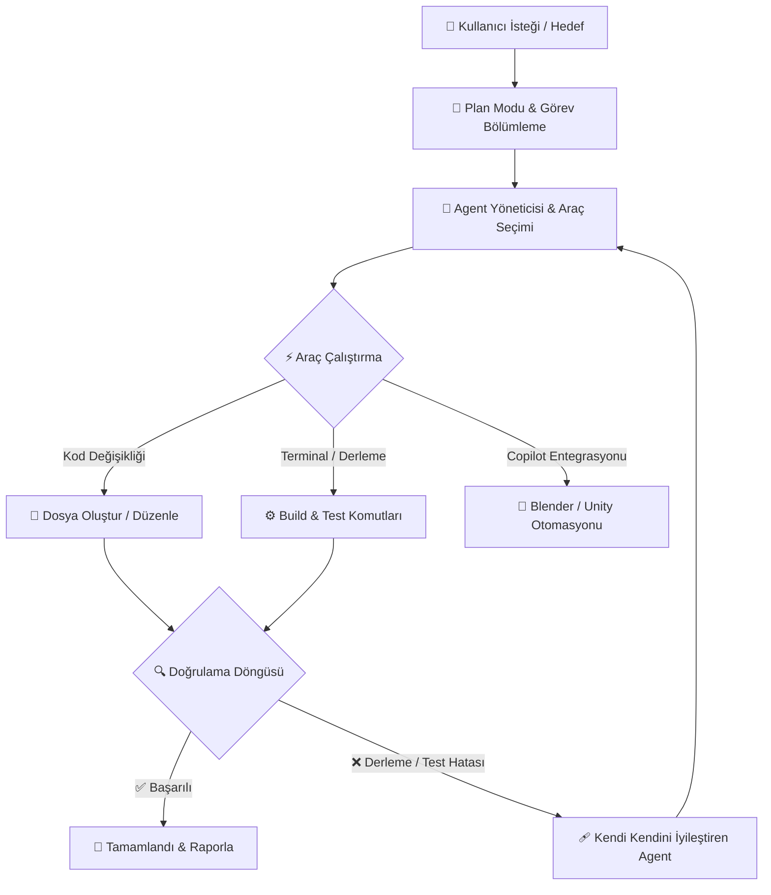

Dili Değiştir: 🇹🇷 Türkçe | [🇺🇸 Read in English](README.md)

---

<p align="center">
  
</p>

# 🚀 Yengi AI IDE

> **Y**our **E**ngineering **N**exus, **G**enerative **I**ntelligence — *Mühendisliğinin Merkezi, Üretken Zekâ.*  
> *"Yengi: Uğraşlarının sonunda ulaştığın o mutlu ve başarılı sonucun adı."*

[](https://github.com/mdaiWorks/yengi/actions/workflows/build-and-test.yml)
[](https://github.com/mdaiWorks/yengi/releases)
[](https://dotnet.microsoft.com/)
[](https://microsoft.com/windows)
[](LICENSE)
[](https://huggingface.co/)

**Yengi; yerel ve bulut AI modelleriyle çalışan, proje dosyalarını okuyup değiştiren, terminal/derleme/test adımlarını yürüten ve kendi kendini düzelten döngüye sahip .NET 10 (LTS) altyapılı açık kaynaklı Windows AI IDE'sidir.**

---

## 🎬 Görsel Vitrin

| 🌐 Web Uygulaması & Görsel Üretimi | 🧊 Canlı 3D Blender Copilot |
| :---: | :---: |
|  |  |

| 🎮 Unity Oyun Motoru Copilot | 🖥️ Modern IDE Çalışma Alanı |
| :---: | :---: |
|  |  |

▶️ **[YouTube Canlı İnceleme ve Tetris Oyunu Yapımı Videosunu İzle](https://youtu.be/l0tdhvCmwNI)**

---

## 🧠 Otonom Agent Mimari Akışı

Yengi basit bir "AI sohbet kutusu" değildir. Kod projeniz üzerinde **Plan → Araç Çağrısı → Kod Değişikliği → Doğrulama → Otomatik Düzeltme** döngüsünü otonom olarak çalıştırır.


```mermaid
flowchart TD
    A["👤 Kullanıcı İsteği / Hedef"] --> B["📝 Plan Modu & Görev Bölümleme"]
    B --> C["🤖 Agent Yöneticisi & Araç Seçimi"]
    C --> D{"⚡ Araç Çalıştırma"}
    D -->|"Kod Değişikliği"| E["📝 Dosya Oluştur / Düzenle"]
    D -->|"Terminal / Derleme"| F["⚙️ Build & Test Komutları"]
    D -->|"Copilot Entegrasyonu"| G["🧊 Blender / Unity Otomasyonu"]
    E --> H{"🔍 Doğrulama Döngüsü"}
    F --> H
    H -->|"✅ Başarılı"| I["🎉 Tamamlandı & Raporla"]
    H -->|"❌ Derleme / Test Hatası"| J["🩹 Kendi Kendini İyileştiren Agent"]
    J --> C
```

---

## ✨ Öne Çıkan Özellikler

- 🔒 **Yerel Odaklı & Model Bağımsız**: **Ollama (Qwen 35B, DeepSeek-R1)**, Claude 3.5, OpenAI veya Gemini ile çalışır. Yerel modellerle %100 veri gizliliği sağlar.
- 🛡️ **Kendi Kendini İyileştiren Doğrulama Döngüsü**: Derleme ve test hatalarını (`dotnet build`, `npm test`, Python linters) otomatik tespit eder ve insan müdahalesi olmadan düzeltir.
- 🔄 **Tek Tıkla Otomatik Güncelleme**: Entegre GitHub Releases API kontrolcüsü ile yeni sürümleri otomatik algılar ve günceller.
- 🧊 **Blender & Unity Copilot Entegrasyonu**: Canlı 3D sahneleri ve oyun motoru bileşenlerini yapay zeka talimatlarıyla doğrudan yönetir.
- ⚡ **.NET 10 (LTS) Gücü**: **200+ birim testi** ile doğruluk ve yüksek performans garantisi.
- 🧰 **30+ Yerel Agent Aracı**: Dosya arama, Git yönetimi, terminal çalıştırma, RAG indeksleme ve canlı web önizleme.

---

## 📖 Detaylı Dokümantasyon & Tüm Araçlar Rehberi

30'dan fazla **AI Agent Aracı**, Kendi Kendini İyileştiren Doğrulama Döngüsü detayları, RAG mimarisi ve arayüz buton kılavuzu için **[Detaylı Dokümantasyon Dosyasına (DOCS_FULL.tr.md)](DOCS_FULL.tr.md)** göz atabilirsiniz | **[Read Full English Docs (DOCS_FULL.md)](DOCS_FULL.md)**.

---

## 🚀 Hızlı Başlangıç

### Yöntem A: Kurulum Exe'si (Önerilen)
1. En son `Yengi_Setup.exe` kurulum dosyasını [GitHub Releases](https://github.com/mdaiWorks/yengi/releases/latest) sayfasından indirin.
2. Kurulumu tamamlayın ve Yengi'yi başlatın.
3. **Ayarlar** sayfasından istediğiniz modeli (Ollama, Anthropic, OpenAI veya Gemini) seçip kodlamaya başlayın!

### Yöntem B: Kaynak Koddan Çalıştırma (.NET 10 SDK)
```bash
# Depoyu klonla
git clone https://github.com/mdaiWorks/yengi.git
cd yengi

# .NET 10 ile derle ve çalıştır
dotnet run --project BasucuIDE/mdaiAgent.csproj
```

---

## 👤 Geliştiriciden Not

> *"Ben bir öğretmenim, profesyonel bir şirket yazılımcısı değilim."*

Yengi'yi bir **Mimarlık ve AI Orchestrator (Yapay Zeka Yöneticisi)** rolü üstlenerek inşa ettim. Kodu üretmek için AI asistanlarından yararlanırken mimariyi, doğrulama döngülerini ve güvenlik sınırlarını kendim kurguladım.

Yengi **%100 Ücretsiz, Açık Kaynaklı ve Telemetrisizdir**. Eğer Yengi projesi size ilham verdiyse GitHub'da ⭐ **Star vererek** destek olabilirsiniz!

---

## 📄 Lisans

[AGPL-3.0 Lisansı](LICENSE) altında dağıtılmaktadır.
